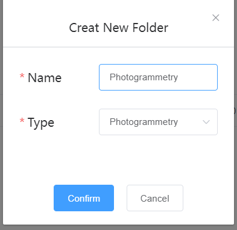

三、使用方法
======

登录 (Log in)
-----------

   浏览器输入无穹智图云平台登录网址： http://www.cscidtss.com/

   输入用户名以及密码，点击

   .. image:: ./media/instru058.png

   即可登录平台。

   .. image:: ./media/image2.png

   图1.1 无穹智图云平台登录界面

   **\**\ 如果没有登录账号，请询问超级管理员并参考\ `6.2增加新用户功能进行新账号的创立 <_6.2增加新用户（Add_New_User）>`__\ 。

项目管理（Project Management）
------------------------

   用户登录之后根据每个账号权限的不同，可以查看对应账号权限下的项目。

   用户点击项目选项卡即可进入指定项目。

   .. image:: ./media/image3.png

2.1创建新项目（Add New Project）
~~~~~~~~~~~~~~~~~~~~~~~~~

   拥有增加项目权限的用户可以通过点击项目页面的“

  .. image:: ./media/instru059.png

  ” 来创建新项目。

   .. image:: ./media/image5.png

   用户需要填写以下项目信息来增加项目。

   其中带有（*）的字段为必填字段，分别为项目名称，以及至少一张图片，其中第一张上传的图片会作为项目列表中选项卡展示的图片。

   用户点击Confirm 之后确认增加项目。

   项目增加成功后会显示在项目列表页面。

   .. image:: ./media/instru060.png

2.2查看项目信息(Basic Information)
~~~~~~~~~~~~~~~~~~~~~~~~~~~~

   用户点击进入该项目之后会进入项目基本信息页面。用户可以查看在创建新项目时填写的信息。

   .. image:: ./media/image7.png

2.3修改项目基本信息（Edit）
~~~~~~~~~~~~~~~~~

   如果用户发现有填写错误的项目信息，可以点击项目基本信息页面的

   .. image:: ./media/instru061.png

   进行修改。可以修改的信息有如下：

   .. image:: ./media/image9.png

   项目名称和展示图片在当前版本中不能修改。

模型显示(Model Display)
-------------------

模型显示功能包括以下功能，用户可以通过左侧菜单栏进行选择，单击进入。

.. list-table::
   :widths: 50 50
   :header-rows: 0

   * -
     - 用途

   * - GIS+Mesh+BIM
     - 用于查看BIM 模型与无人机拍摄的倾斜摄影模型融合沙盘

   * - BIM Model
     - 用于查看BIM 模型

   * - 360 Panorama Model
     - 用于查看360全景模型

   * - 360 Aerial PanoramicModel
     - 用于查看720云模型

   * - Model Comparison
     - 用于同角度对比360全景图片与BIM 模型/同角度对比Mesh和BIM模型

   * - Layout Assistant
     - 用于场地机械模型的布置

3.1 360° 全景模型(360° Panorama Model)
~~~~~~~~~~~~~~~~~~~~~~~~~~~~~~~~~~

用户通过单击左侧导航栏中的360° Panorama Model进入该功能。

360 全景模型功能可运用在工程上常常需要记录现场的情况将现场照片的拍摄工作交给 360 全景相机，不错过项目现场任何细节。另外360全景照片可追溯过去的工地的状况 （如Google街景也可看到过去的街景），这对工程之项目管理、质量管理与合约索赔， 到工程鉴定与诉讼，都有潜在的应用。

3.1.1 360全景图片查看
^^^^^^^^^^^^^^^

   用户可以选择左侧边栏中不同的POI位置对360°全景照片进行查看。用户使用鼠标左键进行拖拽，以及鼠标左键进行视角远近的调节可以进行全景照片模型的查看。

   用户也可以通过搜索框，对目标POI 进行查找。

   .. image:: ./media/image10.png

3.2 BIM 模型(BIM Model)
~~~~~~~~~~~~~~~~~~~~~

3.2.1 查看BIM 模型
^^^^^^^^^^^^^^^

   用户可以使用此功能快速查看BIM 模型。

   .. image:: ./media/image11.png

3.2.2 第一人称视角查看
^^^^^^^^^^^^^^^

   用户可以通过点击第一视角的命令用第一视角对模型内部进行查看。

   .. image:: ./media/image12.png

3.2.3 爆炸图
^^^^^^^^^^^^^^^

   用户可以点击爆炸视图对BIM 模型进行查看， 并可以查看各构件的属性。

   .. image:: ./media/image13.png

3.2.4 用户可以查看不同截面对BIM 模型进行查看。
^^^^^^^^^^^^^^^

   .. image:: ./media/image14.png

3.2.5 用户可以利用测量工具，对BIM 模型进行长度，距离，角度等的测量。
^^^^^^^^^^^^^^^
   .. image:: ./media/image15.png

3.3 多模型叠加显示(GIS + Mesh + BIM)
~~~~~~~~~~~~~~~~~~~~~~~~~~~~~

   GIS + Mesh +BIM的目的是利用地理位置信息(GIS) 叠加Mesh Model 叠加 BIM 模型，帮助用户更快更完整的了解项目建设结果。

   通过无人机倾斜摄影技术，将获取到的影像数据进行三维模型的重建，生成无人机倾斜摄影Mesh Model。

   根据项目实际地形数据与BIM model 的项目基点，与实际项目的地理坐标值进行融合，形成带有地理坐标信息的BIM 模型。

3.3.1 模型的显示与隐藏
^^^^^^^^^^^^^^^

   用户可以通过悬浮模型列表对Mesh模型或者BIM 模型勾选显示，也可以取消选择将其隐藏。

   .. image:: ./media/instru062.png

3.3.2测量工具
^^^^^^^^^^

   用户可以使用该模型查看模型并对模型进行包括距离，高度，面积等简单测量。

   .. image:: ./media/image17.png

3.4施工现场辅助布置(Equipment Layout Assistant)
~~~~~~~~~~~~~~~~~~~~~~~~~~~~~~~~~~~~~~~

用户点击左侧菜单栏中的Equipment Layout Assistant进入该功能。

3.4.1 施工方案的选择（Case selection）
^^^^^^^^^^^^^^^

用户通过点击场布模型图片下的下拉菜单，选择需要绘制的场布模型方案，点击任意Plan 进入该方案。

用户有A,B,C,D,E 5个方案可以选择。

在未选择方案的状态下，是没有办法查看当前场地布置的状态。

.. image:: ./media/instru014.png
   :width: 5.77222in
   :height: 3.22412in

3.4.2 施工设备模型的编辑（Edit）
^^^^^^^^^^^^^^^

用户需要先点击Edit后才能开始进行场地布置。

    .. image:: ./media/instru015.png
       :width: 5.77222in
       :height: 3.07852in

1. 用户在模型列表中选择需要放置的模型，点击该模型图片选择模型，此时该模型的背景高亮，表示已经选择该模型。

2. 用户在场景中点击鼠标左键，即可放置该模型，该模型会在模型列表中出现，且在模型列表中高光显示。

注：塔吊模型会伴随以塔吊基座为圆心，塔吊臂长为半径的风险区域，并显示在风险区域列表中。

用户可重复上述操作，为场景添加多个模型。

    .. image:: ./media/instru016.png
       :width: 5.76042in
       :height: 2.89583in

3.4.4 施工设备模型的旋转，施工设备与风险区域放大缩小
^^^^^^^^^^^^^^^

用户需要在屏幕点击该模型，或者在模型列表中选择该模型，当模型为选中状态（模型为蓝色）时，通过拖动滑块对模型进行旋转，放大缩小的操作。

用户也可以通过先在列表中单击该模型的名称，平台会自动定位到该模型，用户可以对该模型进行旋转，放大缩小的操作。

    .. image:: ./media/instru063.png

    .. image:: ./media/instru064.png

3.4.5 模型位置修改-拖动模型
^^^^^^^^^^^^^^^

用户需要在屏幕中先选中该模型（在列表中选中模型无效），并保持该模型在选中状态（蓝色），用户可通过鼠标左键对模型进行拖拽放置。

3.4.6模型位置修改-修改模型坐标
^^^^^^^^^^^^^^^

用户需要先点击“Edit location”，才可以对位置进行修改，修改完成后，用户点击“Apply Location”完成位置的修改，此时模型会移动到指定的位置。

    .. image:: ./media/instru065.png

    .. image:: ./media/instru066.png

3.4.7 设备模型的显示与隐藏
^^^^^^^^^^^^^^^

用户可以在模型列表与风险区域列表最右侧的图标对其进行显示与隐藏操作。

3.4.8 设备模型的删除
^^^^^^^^^^^^^^^

用户需要先选择模型后，点击

 .. image:: ./media/instru067.png

对设备模型进行删除

3.4.8 方案的保存-手动保存
^^^^^^^^^^^^^^^

用户完成了方案布置后可以通过点击“save”保存方案

    .. image:: ./media/instru017.png
       :width: 5.76042in
       :height: 2.76042in

3.4.9 方案的保存-定时保存
^^^^^^^^^^^^^^^

每间隔5分钟，系统会弹窗提示用户是否需要保存当前方案，用户可以点击” |instru068\ ”来保存当前方案。

方案保存成功时，会在页面上端出现下图字样。

保存失败时，会在页面出现下图字样

3.4.10 Quit
^^^^^^^^^^^^^^^

完成方案之后，用户需要点击Quit来退出Edit模式。

.. image:: ./media/instru021.png
   :width: 5.76042in
   :height: 2.76042in

3.5 模型对比(Model Comparison)
~~~~~~~~~~~~~~~~~~~~~~~~~~

3.5.1 BIM & 360
^^^^^^^^^^^^^^^

本功能用于查看BIM 与360全景照片进行同屏同视角旋转对比。

用户可以在左侧POI 列表中选择在3.5 Pano Management中设置好的模型和角度。

.. image:: ./media/instru022.png
   :width: 5.76042in
   :height: 2.89583in

3.5.2 BIM & Mesh
^^^^^^^^^^^^^^^^

1） 用户点击左侧菜单栏中的Split即可进入分屏显示与时间轴功能。

.. image:: ./media/instru023.png
   :width: 5.76042in
   :height: 2.89583in

2） 用户可以点击页面上端的Layout 选择分屏的数目。

.. list-table::
   :widths: 33 33 33
   :header-rows: 0

   * - 分屏数目
     - 屏幕编号
     - 备注

   * - 2
     - .. image:: ./media/instru069.png
     - 左侧为Viewer 1，右侧为Viewer 2。

   * - 3
     - .. image:: ./media/instru070.png
     - 下方为Viewer 1，上方右侧为Viewer 2，上方左侧为Viewer 3。

   * - 4
     - .. image:: ./media/instru069.png
     - 上方左侧为Viewer 1，上方右侧为Viewer 2， 下方右侧为Viewer 3，下方左侧为Viewer 4。

3）用户可以通过页面下部的不同视口去选择每个视口中需要展示的Mesh 模型的时间，以及是否展示BIM model。

尤其地，BIM 与Mesh 同时展示的功能只存在单视口的情况下。

3.6 填挖方(Cut and Fill(Testing))
~~~~~~~~~~~~~~~~~~~~~~~~~~~~~~

用户通过左侧菜单栏中的Cut and Fill 页面进入功能.

.. image:: ./media/instru025.png
   :width: 5.76042in
   :height: 2.76042in

用户设置好填挖方的绝对高度（默认为50米）之后，用户通过点击Draw后，在倾斜摄影通过左键点击平面上的点，至少绘制3个点确认一个平面，通过右键结束绘制。

用户结束命令后即可自动计算填挖方结果。

问题追踪（Issue Tracking）
--------------------

4.1新增问题（Add New Issue）
~~~~~~~~~~~~~~~~~~~~~~~~~

4.1.1
^^^^^^^^^^^^^^^^

首先用户选择出现问题的全景图片对应的POI。

4.1.2
^^^^^^^^^^^^^^^^

用户通过点击Add new issue 来新增问题。

   .. image:: ./media/instru028.png

4.1.3
^^^^^^^^^

用户通过填写以下表单来新增问题和问题的详情，用户点击“

  .. image:: ./media/instru071.png

”完成问题的添加。

   .. image:: ./media/instru029.png

4.2更新问题状态（Add New Status）
~~~~~~~~~~~~~~~~~~~~~~~~~

用户通过点击出现的问题，在弹出的弹窗中增加问题详情。

点击增加新的问题状态，填写下列信息更新问题状态。

文件管理（File Management）
---------------------

   用户可以通过文件管理上传新的BIM 模型和倾斜摄影模型。

5.1文件夹 （Folder）
~~~~~~~~~~~~~~~

5.1.1 新建文件夹（Add New Folder）
^^^^^^^^^^^^^^^^^^^^^^

   用户通过新建文件夹来分类上传BIM 模型和倾斜摄影模型。

   点击

   .. image:: ./media/instru072.png

   添加文件夹。

   .. image:: ./media/instru073.png

   用户通过填写名称和类型来完成创建新的文件夹。

   一个文件夹中只能上传一种模型。

5.1.2 文件夹的重命名（Rename）
^^^^^^^^^^^^^^^^^^^^^^

   用户可以先点击上传文件列表中的

   .. image:: ./media/instru074.png

   ，在弹出的下拉菜单选择Rename。

   .. image:: ./media/instru032.png

   用户可以通过填写更新后的命名

   .. image:: ./media/instru033.png

5.1.3 文件夹的删除（Delete）
^^^^^^^^^^^^^^^^^^^^^^

   用户可以先点击上传文件列表中的

   .. image:: ./media/instru074.png

   ，在弹出的下拉菜单选择Delete。

   .. image:: ./media/instru034.png

   用户点击Confirm确认删除或者Cancel 取消操作。

   .. image:: ./media/instru035.png

5.2倾斜摄影模型上传（Mesh Model Upload）
~~~~~~~~~~~~~~~~~~~~~~~~~~~~~~

5.2.1 倾斜摄影文件夹的建立（Create New Mesh Model Folder）
^^^^^^^^^^^^^^^^^^^^^^

用户通过新建倾斜摄影模型的文件夹。

创建新倾斜摄影模型类型之后，通过点击文件夹名称进入文件夹。

5.2.2 上传文件
^^^^^^^^^^^^^^^^^^^^^^

用户点击

，并从本机文件中选出需要上传的打包文件。

点击▶开始上传。

或者点击×取消文件上传

文件上传页面下

可以显示当前上传的文件列表。

在倾斜摄影模型上传文件夹中\ **仅能**\ 上传一个.zip格式的文件。

文件上传之后，可以在GIS+Mesh+BIM 功能中查看最新上传的文件。

5.2.3 倾斜摄影文件重命名
^^^^^^^^^^^^^^^^^^^^^^

用户可以先点击上传文件列表中的

，在弹出的下拉菜单选择Rename。

5.2.4 倾斜摄影文件的移动
^^^^^^^^^^^^^^^^^^^^^^

用户可以先点击上传文件列表中的

，在弹出的下拉菜单选择Move to。

注意：只能移动至没有文件的文件夹

5.2.5 倾斜摄影文件的删除
^^^^^^^^^^^^^^^^^^^^^^

用户可以先点击上传文件列表中的

.. image:: ./media/instru074.png ，在弹出的下拉菜单选择Delete。

5.3 全景管理(Pano management)
~~~~~~~~~~~~~~~~~~~~~~~~~

5.3.1 Add Level
^^^^^^^^^^^^^^^

Add Level 的目的是增加层的概念方便用户对全景照片进行分层分类管理。用户可以在Level下继续增加Level来方便对全景图进行管理。

点击屏幕右侧的

.. image:: ./media/instru077

并选择Add Level功能

填写Level Name 点击Submit即可在项目下增加新的Level

用户也可以通过点击Cancel 取消增加Level

5.3.2 Add POI
^^^^^^^^^^^^^

用户可以点击Add POI 增加全景照片。

点击屏幕右侧的

并选择Add POI功能

填写POI Name，添加全景图片和CAD 图片后点击Submit即可在项目下增加新的Level

注意Pano IMG 可以支持的格式为全景照片格式Png或者Jpg

CAD IMG可以支持的格式为Png或者Jpg格式的图片上传。（本版本支持不上传该图片）

用户也可以通过点击Cancel 取消增加Level。

注意：当没有BIM 模型上传时，点击Next 并不会进入3.6.5 对齐操作。

5.3.3 Delete Level or POI
^^^^^^^^^^^^^^^^^^^^^^

点击

触发Delete 命令

弹窗出确认窗口，点击

确认删除

点击

.. image:: ./media/instru080.png

取消删除操作

5.3.4 Edit
^^^^^^^^^^^^

上传完成之后，点击

进行全景图片与BIM 模型对齐的操作。

初始界面为下图所示

5.3.5 对齐
^^^^^^^^^^^^

用户通过调整BIM model的位置与360全景图片进行配准。

具体操作步骤

1. 用户通过双击BIM model里的第一人称视角，通过WASD 等操作寻找与全景图片初始位置一致的BIM model 角度。

2. 用户通过点击

可以重新刷新全景照片的位置，并回到全景照片的初始位置。

3. BIM model位置与360全景图片的位置对齐之后，用户通过点击

，保存当前的视角。

4. 用户点击

结束对齐操作。

人员管理(Personnel Management)
--------------------------

6.1查看该项目的用户列表(User List)
~~~~~~~~~~~~~~~~~~~~~~~~

   用户通过点击左侧侧边栏的Personnel Management 进入该功能。

   可以查看的内容包括，用户的姓名，用户的职位，用户的Email，用户的电话号码，用户的状态。

   .. image:: ./media/instru049.png

   拥有管理权限的用户可以通过点击Add User 进行用户的添加。

   拥有管理权限的用户进行修改或者删除的权力。

6.2增加新用户（Add New User）
~~~~~~~~~~~~~~~~~~~~~~

   拥有管理权限的用户点击Add User 进入增加新用户的页面。

   通过填写用户等信息来添加新用户

   .. image:: ./media/instru050.png

6.3编辑用户（Edit User）
~~~~~~~~~~~~~~~~~~

   拥有管理权限的用户点击Edit 进入修改用户信息页面。

可以编辑的用户信息有名字职位电话号码。

6.4删除用户（Delete User）
~~~~~~~~~~~~~~~~~~~~

   拥有管理权限的用户可以通过点击删除用户按钮触发删除用户的操作。

   .. image:: ./media/instru052.png

   系统会弹窗请拥有管理权限的用户确认是否删除该用户。

   .. image:: ./media/instru053.png

6.5新用户的激活（Activate New User）
~~~~~~~~~~~~~~~~~~~~~~~~~~~~

   新用户需要通过以下步骤来激活账户。

6.5.1
^^^^^^^
填写的邮箱中会收到一个激活的链接，点击链接激活您的账户。 如果新用户在一段时间内不激活该账户，系统会清除账户信息，需要用户重新请求拥有管理权限的用户为他们进行新用户账户的创建。

   .. image:: ./media/instru054.png

6.5.2
^^^^^^
激活的验证码用于确认用户归属。

   .. image:: ./media/instru055.png

6.5.3
^^^^^^
激活成功之后会出现一个弹窗，用户可以点击弹窗，用户点击

   .. image:: ./media/instru085.png

可以开始登录

   .. image:: ./media/instru056.png

6.5.4
^^^^^^
账户的登录账号和密码也会发送到您这个邮箱。

   .. image:: ./media/instru057.png

6.5.5
^^^^^^
可以用邮箱中的账户和密码登录 http://www.cscidtss.com/ 平台

直播（Live）
--------

   点击左侧下拉菜单栏，单击Live 直播功能，进入直播页面。
